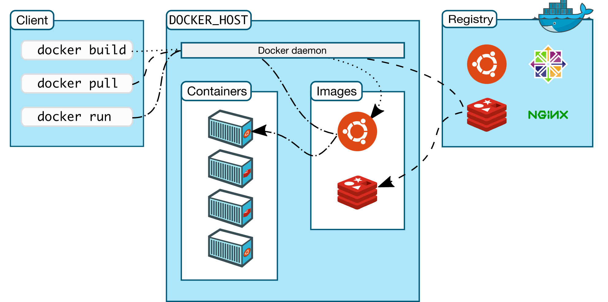

# Docker是什么，可以做什么？

[[toc]]

[toc]

## 😎docker是什么？？？

Docker是一个用于开发，交付和运行应用程序的开放平台。Docker使您能够将应用程序与基础架构分开，从而可以快速交付软件。借助Docker，您可以以与管理应用程序相同的方式来管理基础架构。通过利用Docker的快速交付，测试和部署代码的方法，您可以显着减少编写代码和在生产环境中运行代码之间的延迟。

**docker之所以能发展如此迅速，因为它给出了一个标准化的解决方案—系统平滑移植，容器虚拟化技术**

> 即将开发和运维合并，将原来100%能跑通的源码配置和版本打包成镜像文件（类似于虚拟机vm使用iso镜像文件，虽然是假的，但是和真的一模一样），此时用一种软件docker引擎原封不动的打包过来，实现跨平台之间无缝接轨。

**来自维基百科的介绍：**

**Docker** 使用 `Google` 公司推出的 [Go 语言](https://golang.google.cn/) 进行开发实现，基于 `Linux` 内核的 [cgroup](https://zh.wikipedia.org/wiki/Cgroups)，[namespace](https://en.wikipedia.org/wiki/Linux_namespaces)，以及 [OverlayFS](https://docs.docker.com/storage/storagedriver/overlayfs-driver/) 类的 [Union FS](https://en.wikipedia.org/wiki/Union_mount) 等技术，对进程进行封装隔离，属于 [操作系统层面的虚拟化技术](https://en.wikipedia.org/wiki/Operating-system-level_virtualization)。由于隔离的进程独立于宿主和其它的隔离的进程，因此也称其为容器。最初实现是基于 [LXC](https://linuxcontainers.org/lxc/introduction/)，从 `0.7` 版本以后开始去除 `LXC`，转而使用自行开发的 [libcontainer](https://github.com/docker/libcontainer)，从 `1.11` 版本开始，则进一步演进为使用 [runC](https://github.com/opencontainers/runc) 和 [containerd](https://github.com/containerd/containerd)。


## Docker平台

Docker提供了在松散隔离的环境（称为容器）中打包和运行应用程序的功能。隔离和安全性使您可以在给定主机上同时运行多个容器。容器是轻量级的，包含运行该应用程序所需的所有内容，因此您无需依赖主机上当前安装的内容。您可以在工作时轻松共享容器，并确保与您共享的每个人都能以相同的方式获得相同的容器。

Docker提供了工具和平台来管理容器的生命周期：

- 使用容器开发应用程序及其支持组件。
- 容器成为分发和测试您的应用程序的单元。
- 准备就绪后，可以将应用程序作为容器或协调服务部署到生产环境中。无论您的生产环境是本地数据中心，云提供商还是两者的混合，其工作原理都相同。


## 我可以将Docker用于什么？

**快速，一致地交付您的应用程序（有多快😍 试试就逝世）**

**Docker通过允许开发人员使用提供您的应用程序和服务的本地容器在标准化环境中工作，从而简化了开发生命周期。容器非常适合进行持续集成和持续交付（CI / CD）工作流。**

考虑以下示例方案：

- 您的开发人员在本地编写代码，并使用Docker容器与同事共享他们的工作。
- 他们使用Docker将其应用程序推送到测试环境中，并执行自动和手动测试。
- 当开发人员发现错误时，他们可以在开发环境中对其进行修复，然后将其重新部署到测试环境中以进行测试和验证。
- 测试完成后，将修补程序推送给生产环境就像将更新的映像推送到生产环境一样简单。

**响应式部署和扩展**

Docker的基于容器的平台允许高度可移植的工作负载。Docker容器可以在开发人员的本地笔记本电脑上，数据中心内的物理或虚拟机上，云提供商上或混合环境中运行。

Docker的可移植性和轻量级的特性还使您可以轻松地动态管理工作负载，并根据业务需求指示实时扩展或拆除应用程序和服务。

**在相同的硬件上运行更多的工作负载**

Docker轻巧快速。它为基于虚拟机管理程序的虚拟机提供了一种可行的，具有成本效益的替代方案，因此您可以利用更多的计算能力来实现业务目标。Docker非常适合高密度环境以及中小型部署，而您需要用更少的资源做更多的事情。

## Docker架构

Docker使用客户端-服务器架构（C/S架构）。Docker*客户端*与Docker**守护进程**进行对话，该**守护进程**完成了构建，运行和分发Docker容器的繁重工作。Docker客户端和守护程序*可以* 在同一系统上运行，或者您可以将Docker客户端连接到远程Docker守护程序。Docker客户端和守护程序在UNIX套接字或网络接口上使用**REST API**进行通信。另一个Docker客户端是Docker Compose，它使您可以处理由一组容器组成的应用程序。

> 关于PESTAPI好像是在网路里面有讲



> client是客户端，docker_host是一个引擎，如果是有镜像，就会组成一个个服务器实例,是本地的库，如果本地库1没有的话就是从远程库registry上zhao


### Docker守护程序

Docker守护程序（`dockerd`）侦听Docker API请求并管理Docker对象，例如图像，容器，网络和卷。守护程序还可以与其他守护程序通信以管理Docker服务。


### Docker客户端

Docker客户端（`docker`）是许多Docker用户与Docker交互的主要方式。当您使用诸如之类的命令时`docker run`，客户端会将这些命令发送到`dockerd`，以执行这些命令。该`docker`命令使用Docker API。Docker客户端可以与多个守护程序通信。


### Docker注册表

Docker注册表存储Docker映像。**Docker Hub是任何人都可以使用的公共注册表**，并且默认情况下，Docker已配置为在Docker Hub上查找映像。您甚至可以运行自己的私人注册表。

使用`docker pull`或`docker run`命令时，将从配置的注册表中提取所需的图像。使用该`docker push`命令时，会将映像推送到已配置的注册表。


### Docker对象

使用Docker时，您正在创建和使用映像，容器，网络，卷，插件和其他对象。本节是其中一些对象的简要概述。

#### 图片

一个*图像*是用于创建一个码头工人容器指令的只读模板。通常，一个映像*基于*另一个映像，并进行一些其他自定义。例如，您可以基于该`ubuntu` 映像构建映像，但安装Apache Web服务器和您的应用程序，以及运行该应用程序所需的配置详细信息。

您可以创建自己的图像，也可以仅使用其他人创建并在注册表中发布的图像。要构建自己的映像，您可以 使用简单的语法创建一个*Dockerfile*，以定义创建映像并运行它所需的步骤。Dockerfile中的每条指令都会在映像中创建一个层。当您更改Dockerfile并重建映像时，仅重建那些已更改的层。与其他虚拟化技术相比，这是使映像如此轻巧，小型和快速的部分原因。

#### 货柜

容器是图像的可运行实例。您可以使用Docker API或CLI创建，启动，停止，移动或删除容器。您可以将容器连接到一个或多个网络，将存储连接到它，甚至根据其当前状态创建一个新映像。

默认情况下，容器与其他容器及其主机之间的隔离度相对较高。您可以控制容器的网络，存储或其他底层子系统与其他容器或与主机的隔离程度。

容器由其映像以及在创建或启动时为其提供的任何配置选项定义。删除容器后，未存储在持久性存储中的状态更改将消失。


### 示例`docker run`命令

以下命令运行一个`ubuntu`容器，以交互方式附加到本地命令行会话，然后运行`/bin/bash`。

```bash
docker run -i -t ubuntu /bin/bash    #-it
```

**当您运行此命令时，会发生以下情况（假设您使用的是默认注册表配置）：**

1. 如果您在`ubuntu`本地没有该映像，则Docker会将其从已配置的注册表中拉出，就像您已`docker pull ubuntu`手动运行一样。
2. Docker会创建一个新容器，就像您已`docker container create` 手动运行命令一样。
3. Docker将一个读写文件系统分配给容器，作为其最后一层。这允许运行中的容器在其本地文件系统中创建或修改文件和目录。
4. Docker创建了一个网络接口，将容器连接到默认网络，因为您没有指定任何网络选项。这包括为容器分配IP地址。默认情况下，容器可以使用主机的网络连接连接到外部网络。
5. Docker启-动容器并执行`/bin/bash`。由于容器是交互式运行的，并且已附加到您的终端（由于`-i`和`-t` 标志），因此您可以在输出记录到终端时使用键盘提供输入。
6. 当您键入`exit`以终止`/bin/bash`命令时，容器将停止但不会被删除。您可以重新启动或删除它。


::: warning 提醒
你甚至可以和容器交互式使用，就像你`ssh`进入Linux一样，你可以在进去的那一瞬间指定命令

:::


## 底层技术

Docker用[Go编程语言](https://golang.org/)编写，**并利用Linux内核的多种功能来交付其功能。**Docker使用一种称为的技术`namespaces`来提供称为容器的隔离工作区。运行容器时，Docker会为该容器创建一组 名称空间。

这些名称空间提供了一层隔离。容器的每个方面都在单独的名称空间中运行，并且对其的访问仅限于该名称空间。

> 后面会对docker的底层源码进行解析，有兴趣的可以关注我的博客
>
> + [x] [Myblog](http://nsddd.top)


### docker的目标

build,ship and Run Any App,Anywhere

**通过对应用组件的封装、分发、部署、运行等生命周期的管理，使用户的APP（或者web或database）和运行环境能达到“一次镜像，处处运行”**

docker是linux容器技术的一种实现。实现了跨平台和跨服务器。

